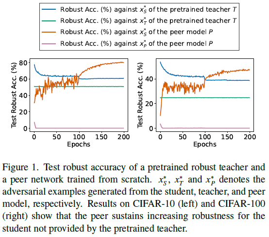

# PeerAiD : Improving Adversarial Distillation from a Specialized Peer Tutor [CVPR 2024]

* Code for CVPR 2024 "[PeerAiD : Improving Adversarial Distillation from a Specialized Peer Tutor](https://arxiv.org/abs/2403.06668)".
* This repository includes the training code and scripts to reproduce the results of [the paper](https://arxiv.org/abs/2403.06668).
* The [video](https://www.youtube.com/watch?v=qxQiHhbQ8kU), [slides](https://drive.google.com/drive/folders/1eN4oImgI4-IqM9XpM6scHXYwZ9dbaRcO?usp=sharing) and [poster](https://drive.google.com/file/d/1LKaqoHAtAnGfOXzyHDCx6uAFKmyWP2ut/view?usp=sharing) are available.



## Environment settings and libraries.
- OS : Ubuntu
- GPU : NVIDIA A100
- CUDA : 11.7
- python : 3.9
- pytorch : 1.13.1


## Setup
* Install the required packages by executing the following command.
```
pip install -r requirements.txt
```


## Training scripts.

* These are the commands which reproduce the result of PeerAiD presented in Table 1 of the paper.

#### 1. ResNet-18 with CIFAR-10.
```
python3 main.py --p_type resnet18 --s_type resnet18 --kd --k_train 10 --exp_id 1 --temperature 5 --gamma1 1 --gamma2 0.1 --re_kd_temperature 1 --config_path ./configs/PeerAiD_resnet18_cifar10.json --AA --dataset cifar10 --fgsm_eval --pgd_eval --lamb1 0 --lamb2 1 --lamb3 1 --swa_s
```


#### 2. ResNet-18 with CIFAR-100.

```

python3 main.py --p_type resnet18 --s_type resnet18 --kd --k_train 10 --exp_id 2 --temperature 5 --gamma1 1 --gamma2 1 --re_kd_temperature 1 --config_path ./configs/PeerAiD_resnet18_cifar100.json --AA --dataset cifar100 --fgsm_eval --pgd_eval --lamb1 0 --lamb2 1 --lamb3 1 --swa_s
```


#### 3. ResNet-18 with TinyImageNet.

```
python3 main.py --p_type resnet18 --s_type resnet18 --kd --k_train 10 --exp_id 3 --temperature 1 --gamma1 1 --gamma2 100 --re_kd_temperature 1 --config_path ./configs/PeerAiD_resnet18_tinyimagenet.json --AA --dataset tinyimagenet --data_path {your_data_path} --fgsm_eval --pgd_eval --lamb1 0.035 --lamb2 35 --lamb3 20 --swa_s 
```

#### 4. WideResNet34-10 with CIFAR-10.

```
python3 main.py --p_type wideresnet34x10 --s_type wideresnet34x10 --kd --k_train 10 --exp_id 4 --temperature 5 --gamma1 1 --gamma2 0.1 --re_kd_temperature 1 --config_path ./configs/PeerAiD_wideresnet34x10_cifar10.json --AA --dataset cifar10 --fgsm_eval --pgd_eval --lamb1 0 --lamb2 1 --lamb3 1 --swa_s
```


#### 5. WideResNet34-10 with CIFAR-100.
```
python3 main.py --p_type wideresnet34x10 --s_type wideresnet34x10 --kd --k_train 10 --exp_id 5 --temperature 5 --gamma1 1 --gamma2 1 --re_kd_temperature 1 --config_path ./configs/PeerAiD_wideresnet34x10_cifar100.json --AA --dataset cifar100 --fgsm_eval --pgd_eval --lamb1 0 --lamb2 1 --lamb3 1 --swa_s
```


#### 6. WideResNet34-10 with TinyImageNet.
```
python3 main.py --p_type wideresnet34x10 --s_type wideresnet34x10 --kd --k_train 10 --exp_id 6 --temperature 1 --gamma1 1 --gamma2 100 --re_kd_temperature 1 --config_path ./configs/PeerAiD_wideresnet34x10_tinyimagenet.json --AA --dataset tinyimagenet --data_path {your_data_path} --fgsm_eval --pgd_eval --lamb1 0.035 --lamb2 35 --lamb3 20 --swa_s
```


## License

This project is licensed under the terms of the GNU General Public License v3.0


## Citation
```
@inproceedings{jung2024peeraid,
  title={PeerAiD : Improving Adversarial Distillation from a Specialized Peer Tutor},
  author={Jung, Jaewon and Jang, Hongsun and Song, Jaeyong and Lee, Jinho},
  booktitle={Proceedings of the IEEE/CVF Conference on Computer Vision and Pattern Recognition},
  year={2024}
}
```